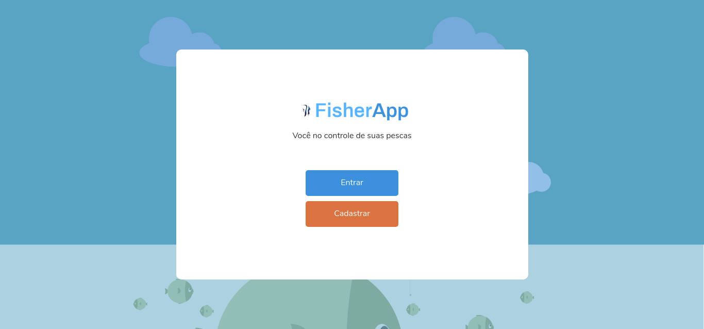
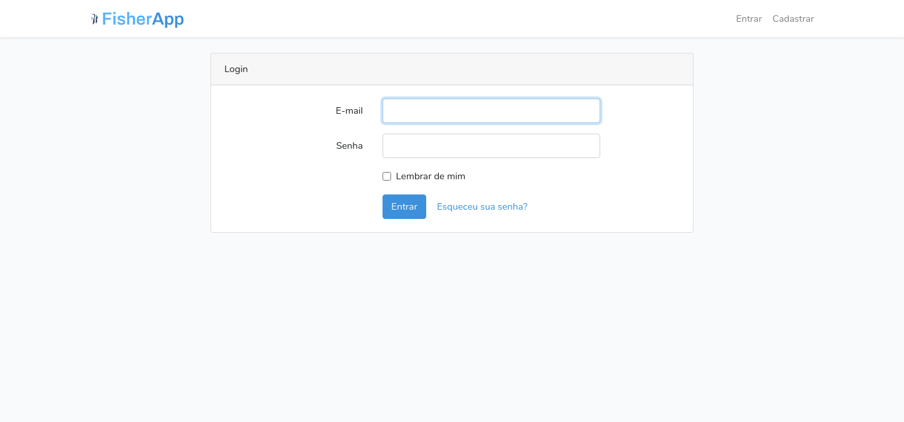
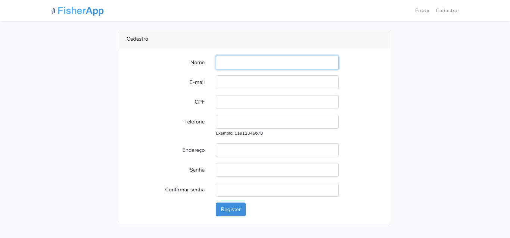
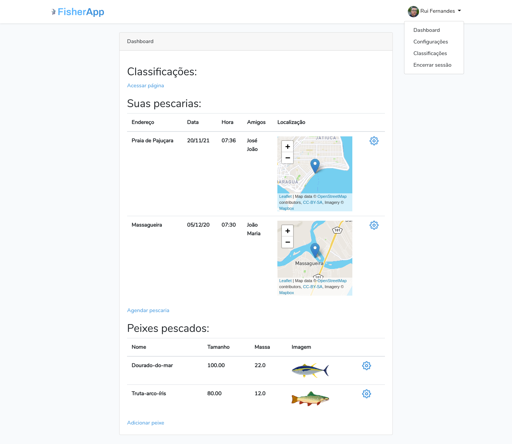
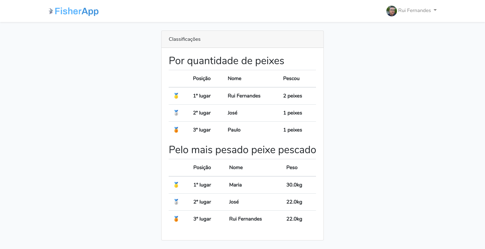
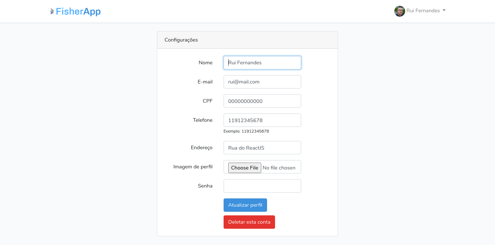
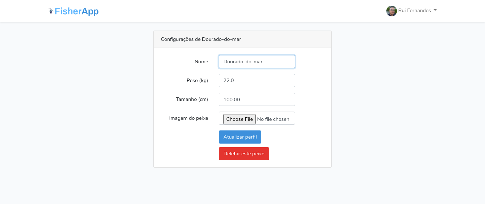
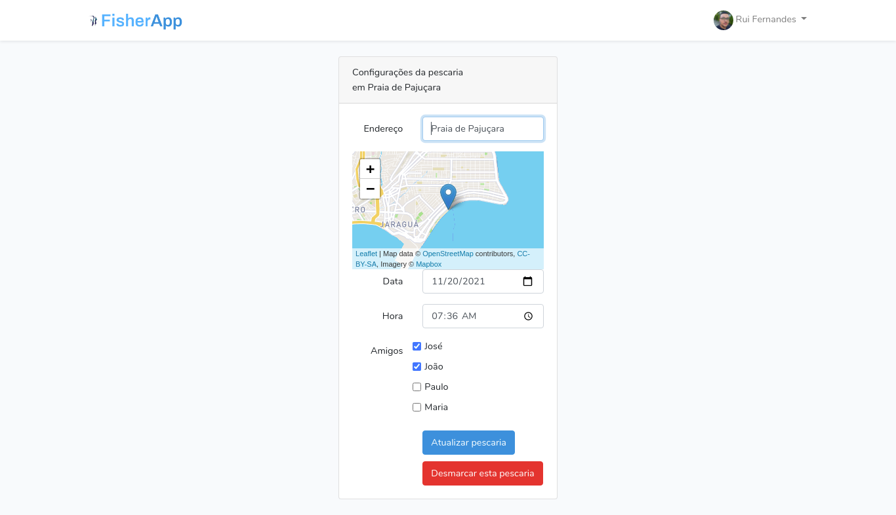
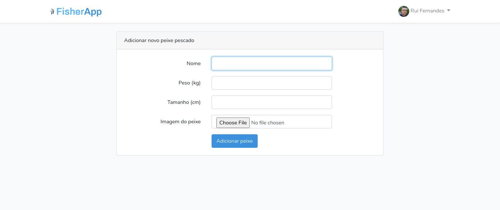
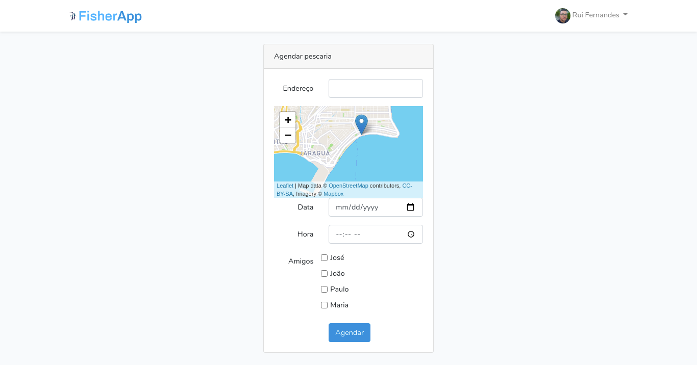

# 🐟 FisherApp


## 📝 Description
> English

FisherApp is a platform which fishers can schedule fishings with their friends and save the data of their fished fishes.

> Português

FisherApp é uma plataforma na qual pescadores podem agendar pescarias com seus amigos e salvar nela as informações de seus peixes pescados.

## 💻 Technologies
- Laravel (back-end framework)
- Bootstrap (css framework)
- Leaflet (for the maps in the platform / para os mapas na plataforma)
- MySQL/MariaDB (Database)

## 🚀 Run on your machine
> Initial steps
```bash
$ git clone https://github.com/ruifernandees/fisherapp.git
$ cd fisherapp
```

>Create database (MySQL/MariaDB)
```sql
CREATE DATABASE fisherapp;
```

> Project setup
```bash

# Install PHP dependencies
$ composer install

# Install JS dependencies
$ npm install

# Run all migrations
$ php artisan migrate

# Run the UserSeeder seed, that creates some users
$ php artisan db:seed --class=UserSeeder

```

> Run project
```bash
# Run the project
$ php artisan serve

# Run npm
$ npm run dev
```

## Screens
<div>
    <p>Login Screen</p>
    
</div>
<div>
    <p>Register Screen</p>
    
</div>
<div>
    <p>Dashboard</p>
    
</div>
<div>
    <p>Ranking</p>
    
</div>
<div>
    <p>User settings</p>
    
</div>
<div>
    <p>Fish update/delete</p>
    
</div>
<div>
    <p>Fishing update/delete</p>
    
</div>
<div>
    <p>Add fish</p>
    
</div>
<div>
    <p>Schedule fishing</p>
    
</div>